# Fișa Disciplinei — Course Syllabus Builder

> A full-stack web app that lets university faculty fill in the official course
> syllabus ("Fișa Disciplinei") online, computes hours and ECTS credits
> automatically, and exports a ready-to-sign Word/PDF document in Romanian or
> English.

Built for the **Faculty of Government and Communication Sciences (FSGC), West University
of Timișoara (UVT)**, and **in production use at
the faculty** since September 2026.

> **Note:** this repository is a project showcase. The application runs on the
> faculty's infrastructure with real institutional data, so the source code is
> kept in a private repository. Code walkthroughs are available on request.

---

## The problem

Every course in a Romanian university needs a *Fișa Disciplinei*: a ~10-section
document required by ARACIS, the national quality-assurance agency. Faculty
used to fill it in by hand in a Word template, every year, for every course:

- copying data that already exists in the curriculum (program, year, semester,
  course code, hours) by hand;
- calculating total study hours and ECTS credits manually, with different
  rules per department and course type, which caused frequent errors;
- breaking the template's formatting while editing;
- maintaining a separate English version for English-taught programs.

## What the app does

- **Guided 8-step wizard.** The 10 official sections are grouped into 8 steps
  (language → program & course → time & credits → prerequisites & objectives →
  content → generative AI usage → assessment → finalize), with step validation
  where it matters.
- **Pre-filled from the curriculum.** A cascading picker (department → field →
  program → course) pulls the course's data from a catalog of **600+ courses**
  imported from the faculty's Excel curriculum. Every pre-filled value stays
  editable.
- **Automatic hours and ECTS credits.** Weekly hours roll up into semester
  totals and credits through a **data-driven rule engine**: the hours-per-credit
  divisor depends on the department and on the course type (standard,
  internship, thesis preparation). The rules live in the database, not in code,
  and the computed value is a suggestion that faculty can override.
- **Learning outcomes from the curriculum.** Instead of free text, faculty pick
  the learning outcomes (knowledge, skills, autonomy) their course covers from
  the official list of their study program.
- **Generative AI usage section.** A newly required section on how students
  may use AI tools, with codified options rendered as standard sentences in
  both languages.
- **Continuous autosave.** A debounced save (create on first edit, update
  after that) with a visible status indicator, so nothing is lost if the tab
  closes.
- **Bilingual export.** One click generates a `.docx` from the official Word
  template and a `.pdf` through a headless LibreOffice service, in Romanian or
  English. Institution names are translated automatically.
- **Admin area.** Idempotent Excel import (courses and instructors) with an
  import summary (created / updated / needs review / errors), full course CRUD,
  and instructor management. It is protected by an access code that is checked
  server-side on every admin API call and rate-limited.
- **Dark mode** and a responsive UI designed for non-technical users.

## How it works: a walkthrough

The app is in Romanian, the language of its users. The screenshots below
follow one faculty member filling in a syllabus from start to finish, using
demo data.

### 0. Home

The faculty member starts a new syllabus. The admin area is reached from the
same page and asks for an access code.

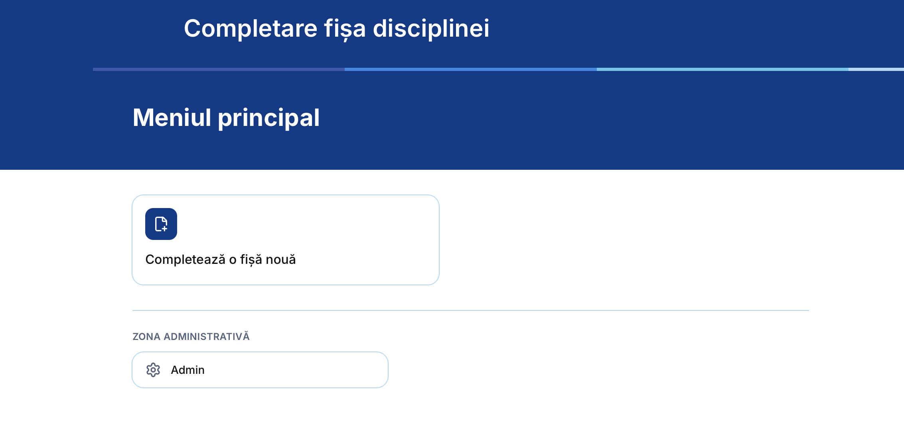

### 1. Language

The first choice decides which official template is used at export:
Romanian or English. In English, institution names are translated
automatically. The progress bar shows the 8 steps of the wizard.

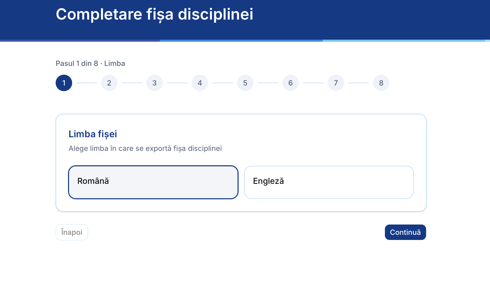

### 2. Program & course (sections 1–2)

A cascading picker narrows the catalog: department → field of study → cycle
(bachelor / master) → study program → year and semester. Picking the course
pre-fills its code, assessment type and status from the curriculum. Instructor
fields autocomplete from the instructor list but also accept a new name. The
numbers in brackets (1.3, 2.1, …) match the fields of the official form, so the
screen maps one-to-one onto the paper document.

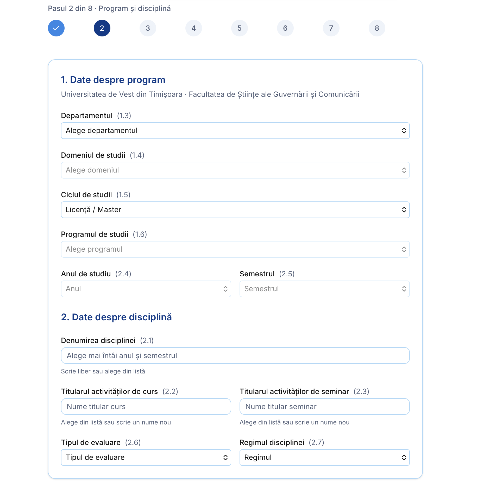

### 3. Time & credits (section 3)

Weekly hours for lectures and seminars are limited to the values the faculty
allows (0, 1 or 2). Everything else is derived live: weekly total (3.1),
semester totals for a fixed 14-week semester (3.4–3.6), individual study
(3.7) and overall semester load (3.8).

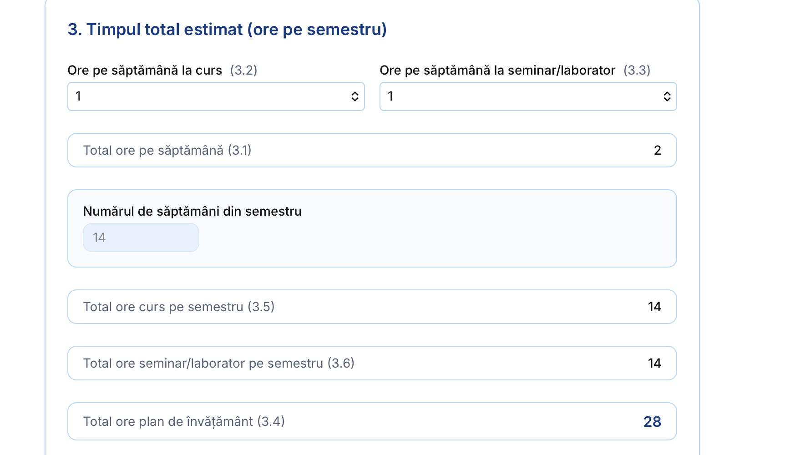

The total load is then turned into **ECTS credits (3.9)** by the rule engine
(hours ÷ divisor, chosen by department and course type). The result is a
suggestion that the faculty member can still override.

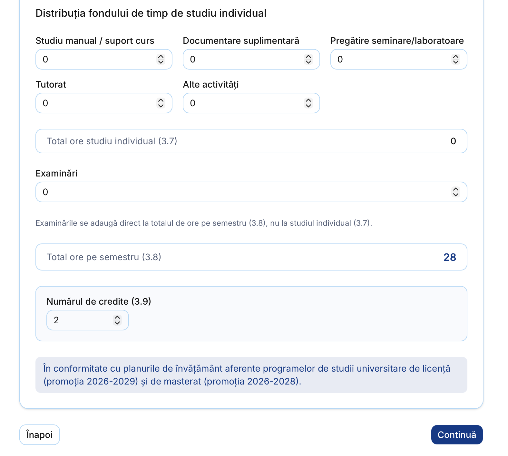

### 4. Prerequisites, conditions & learning outcomes (sections 4–6)

Free-text fields with examples as placeholders. Learning outcomes are grouped
into the three official categories (knowledge, skills, responsibility and
autonomy). This is the only step that has to be completed before moving on.

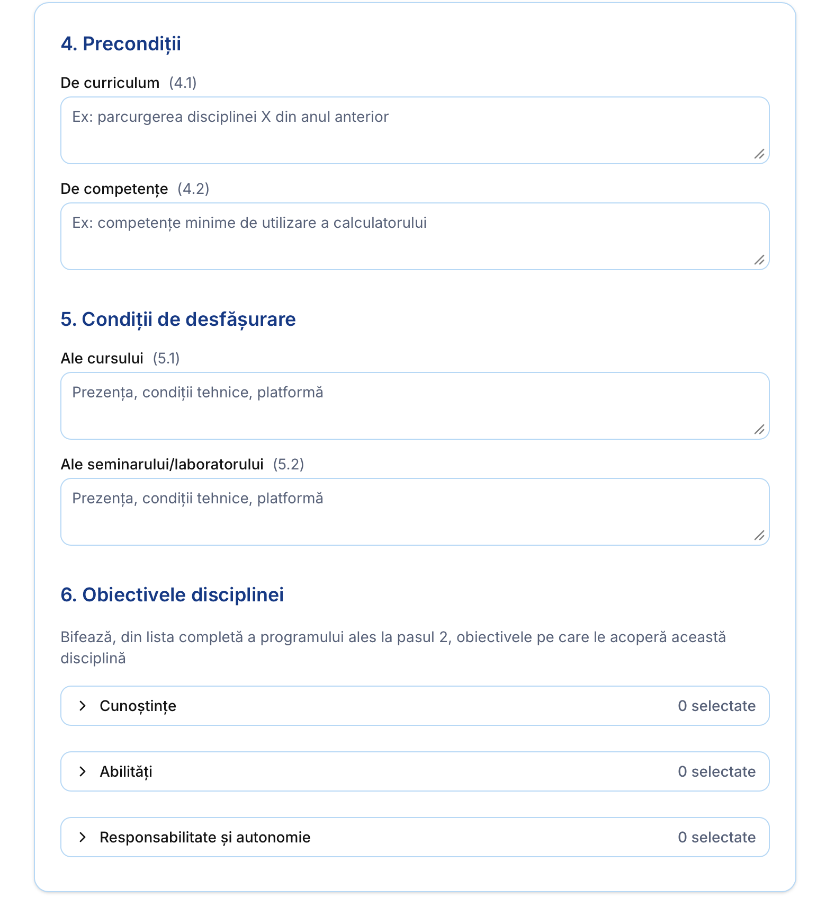

Instead of writing learning outcomes from scratch, the faculty member opens a
category and **ticks the ones this course covers** from the official list of
the study program picked in step 2. The list is searchable, which matters
because a program can define dozens of outcomes per category.

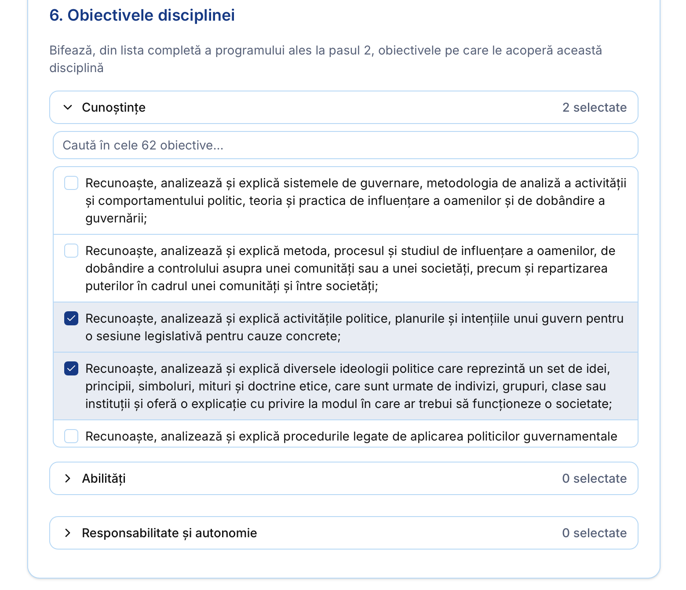

### 5. Course content (sections 7–8)

Lecture and seminar topics are dynamic lists: rows can be added and removed,
each with a teaching method and notes, plus a bibliography for each activity
and a note on how lectures and seminars connect.

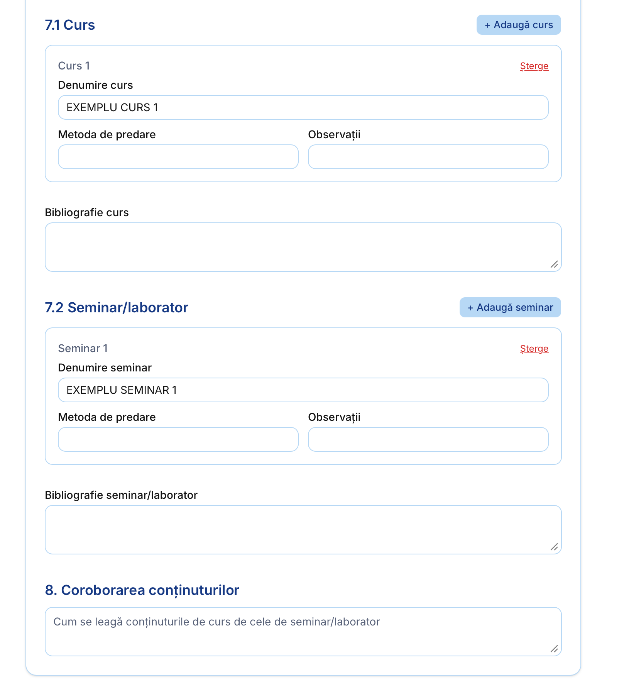

### 6. Generative AI usage (section 9)

A newly required section. Two dropdowns record where the rule applies and
whether students may use generative AI tools. The app turns the choice into
the standard wording from the university's regulation, in the export language.

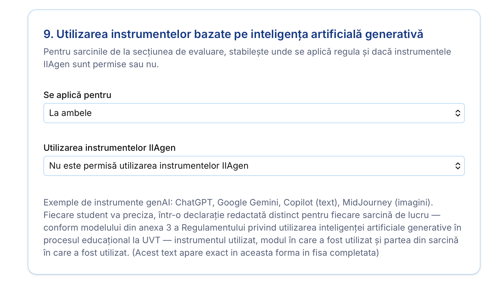

### 7. Assessment (section 10)

Assessment criteria, methods and weights for lectures and seminars. The app
checks that the weights add up to 100%, plus the minimum performance standard.

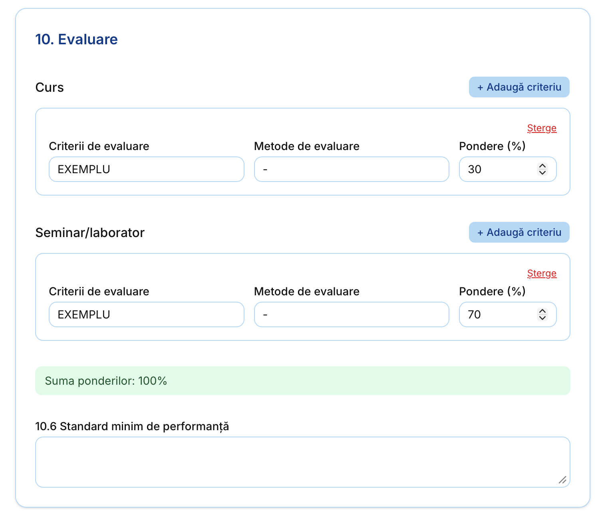

### 8. Finalize & export

The last step exports the syllabus as `.docx` (filled into the official Word
template) or `.pdf`. Everything is autosaved along the way, so a syllabus
can be left and resumed at any time.

<!-- Optional: add a screenshot of the final step or of the exported PDF, e.g.

-->

## Architecture

The whole app is a single Next.js process: the App Router's route handlers
*are* the REST API, so there is no separate backend. The business logic lives in
plain TypeScript modules, which keeps it framework-free and unit-testable.

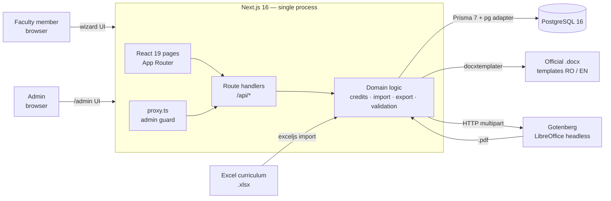

**Production deployment:** Docker Compose runs PostgreSQL, Gotenberg, the app
(a Next.js `standalone` build that applies migrations on startup), and Nginx,
which terminates TLS with auto-renewing Let's Encrypt certificates. The
database and the PDF service are never exposed publicly.

### Data model (simplified)

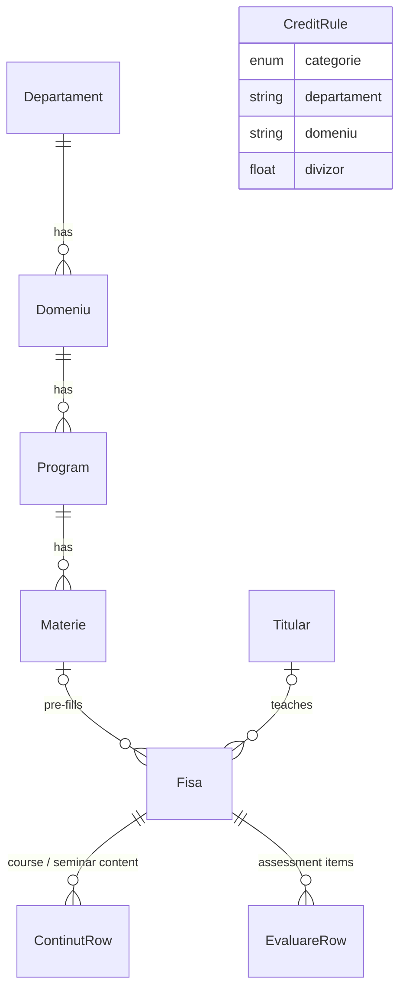

A syllabus (`Fisa`) stores an **editable snapshot** of every field rather than
reading live from the catalog. Later curriculum changes never silently alter a
syllabus that is already completed, and deleting a catalog entry only detaches
the link (`ON DELETE SET NULL`).

## Engineering highlights

- **Credit rules as data, not code.** Rules are matched from the most specific
  to the most general: domain-specific override → department rule → global
  default. Adding a department or changing a divisor needs no deployment.
- **A data-loss bug in the importer.** The Excel importer treated
  "placeholder" cells (`-`, `n/a`, …) as empty. The first, unanchored regex also
  matched *"na"* inside valid Romanian words ("guver**na**nță") and silently
  dropped data. Anchoring the pattern to the whole cell recovered **~180
  courses and ~1,000 rows**.
- **Derived fields must be persisted.** Live-computed totals rendered correctly
  but never reached the database until they were synced into form state
  explicitly. This is a classic React pitfall, now a documented pattern in the
  codebase.
- **Accessible over fancy.** A custom select component had a reproducible
  positioning bug with mouse clicks, so it was replaced with native
  `<select>` elements, which also suit the less technical audience better.
- **Admin security without sessions.** The access code is stored only as a
  SHA-256 hash and compared in constant time. Each admin request is checked by
  the Next.js proxy, with per-IP rate limiting on unlock attempts.
- **Modern stack, recent breaking changes.** Prisma 7 (driver adapters,
  connection config in `prisma.config.ts`) and Next.js 16 (`middleware` →
  `proxy`) were both adopted while their APIs were still new.

## Testing

**117 unit tests in 13 files** (Vitest), covering the pure domain logic: credit
calculation, semester and hour rules, Excel import rules, Word-template data
mapping, step validation, learning-outcome lookup, AI-usage text generation,
and admin authentication and rate limiting.

## Tech stack

| Layer | Tools |
|---|---|
| Framework | Next.js 16 (App Router, Turbopack), React 19, TypeScript |
| UI | Tailwind CSS 4, shadcn/ui, Base UI, lucide-react |
| Data | PostgreSQL 16, Prisma 7 (`@prisma/adapter-pg`), Zod 4 |
| Documents | docxtemplater + PizZip (Word), Gotenberg 8 (PDF), exceljs (import) |
| Testing | Vitest 4 |
| Infrastructure | Docker Compose, Nginx, Let's Encrypt / Certbot |

**Scale:** ~11k lines of TypeScript · 600+ courses · 3 database migrations ·
built from August to September 2026.

## Team

| | Role |
|---|---|
| **Flavius Neamu** — [@Flavius1012](https://github.com/Flavius1012) | Full-stack development |
| **Raul Daniel Macovei** — [@raul-dan23](https://github.com/raul-dan23) | Full-stack development |

---

© 2026 Flavius Neamu & Raul Daniel Macovei. All rights reserved. This
repository contains documentation only.
